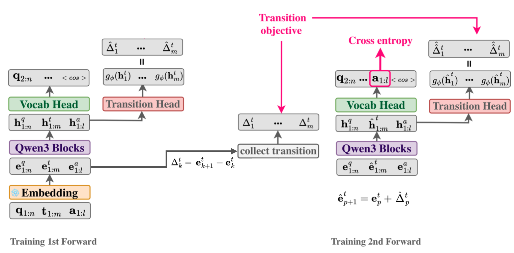

# Geometric Latent Reasoning Induces Shorter Generations in LLMs

**NeurIPS 2026** · [Paper](https://arxiv.org/abs/2606.02248) · [Project page](https://glr-llm.github.io/)

Shashi Kumar<sup>1,2,\*</sup>, Yacouba Kaloga<sup>1,\*</sup>, Petr Motlicek<sup>1,3</sup>, Ina Kodrasi<sup>1</sup>, Andrea Cavallaro<sup>2</sup>

<sup>1</sup>Idiap Research Institute, Switzerland · <sup>2</sup>EPFL, Switzerland · <sup>3</sup>Brno University of Technology, Czech Republic
<br><sub>\* Equal contribution</sub>



## TL;DR

We treat chain-of-thought as a path through the model's own token-embedding space and train a lightweight transition head to predict the next step's direction. At inference, the model takes a few continuous latent steps before resuming normal decoding, and then reaches correct answers with **~80% fewer generation steps**. No length penalty is used; the shorter generations emerge on their own.

## Abstract

Large language models solve complex problems by generating lengthy chains of explicit reasoning tokens. While effective, this makes reasoning expensive, length-sensitive, and constrained to (discrete) natural language. While latent reasoning offers a continuous alternative, determining useful structures for intermediate latent states is an open challenge. In this paper, we formulate latent reasoning as a geometric path-approximation problem within the model's pretrained token-embedding space. We introduce Geometric Latent Reasoning (GLR), which uses a lightweight transition head to predict iterative direction updates in embedding space. Using textual chain-of-thought traces as anchors, GLR learns to approximate discrete reasoning trajectories while permitting continuous deviations from exact token embeddings. Evaluations on mathematical reasoning benchmarks using Qwen3 models reveal an emergent phenomenon: geometric latent reasoning induces substantially shorter generations without an explicit length objective. By replacing early explicit reasoning with continuous latent steps, models often reach correct answers using substantially fewer total generation steps. These findings suggest that continuous trajectories act as compact intermediate reasoning states, exposing a new tradeoff between latent computation budget, output length, and accuracy.

## Citation

```bibtex
@article{kumar2026geometric,
  title={Geometric Latent Reasoning Induces Shorter Generations in LLMs},
  author={Kumar, Shashi and Kaloga, Yacouba and Motlicek, Petr and Kodrasi, Ina and Cavallaro, Andrea},
  journal={Advances in Neural Information Processing Systems},
  year={2026}
}
```
